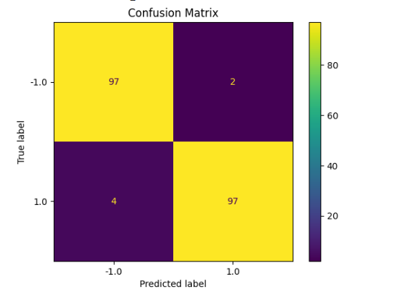
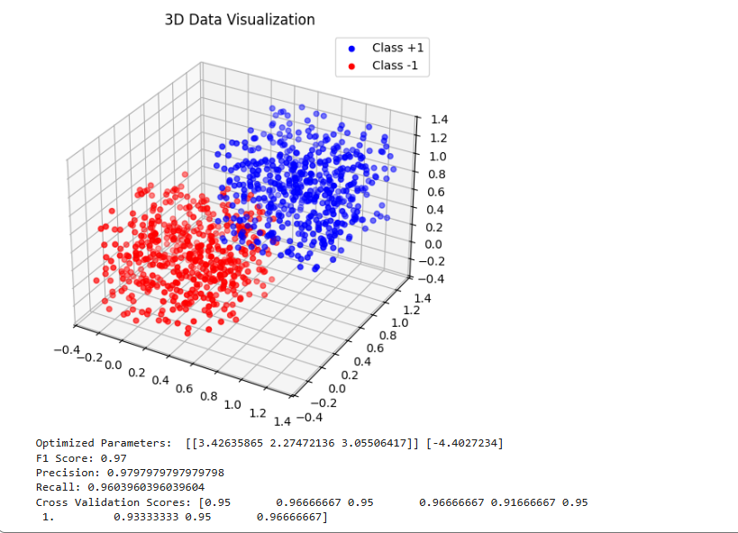

# Results and Analysis: Support Vector Machine (SVM) for Linearly Separable 3D Dataset

## Confusion Matrix
The confusion matrix displays the performance of our SVM model in predicting the labels for the testing dataset.

### Interpretation:
- **True Positives (97)**: Instances correctly classified as `+1`.
- **True Negatives (97)**: Instances correctly classified as `-1`.
- **False Positives (2)**: `-1` instances misclassified as `+1`.
- **False Negatives (4)**: `+1` instances misclassified as `-1`.

The low number of false positives and false negatives indicates that the model performs well in distinguishing between the two classes.

---

## 3D Data Visualization
The 3D scatter plot illustrates the dataset points and their classification.

### Features:
- The dataset is linearly separable to a large extent, as seen in the classification visualization.
- The points belonging to `Class +1` are assigned the color blue, and those belonging to `Class -1` are red.

---

## Performance Metrics
The following metrics provide detailed insights into the performance of the model:

- **Optimized Parameters (w, b)**: 
  - `w` = [[3.42635865, 2.27472136, 3.05506417]]
  - `b` = [-4.4027234]
  
  These parameters are the coefficients of the hyperplane that optimally separates the two classes.

- **F1 Score**: 0.97  
  A high F1 score reflects the harmonic mean of precision and recall, ensuring a balanced performance across positive and negative predictions.

- **Precision**: 0.9797979797979798  
  The fraction of positive predictions that are correct.

- **Recall**: 0.9603960396039604  
  The fraction of positive instances correctly identified.

- **Cross-Validation Average Score**: 0.95  
  Stability of the model is demonstrated by consistently high scores in 10-fold cross-validation.

---

## Satisfactory Model Performance
Based on the metrics:
- The confusion matrix demonstrates a high level of accuracy in classification.
- Precision and Recall values are close to 1.0, indicating high reliability in detecting both classes with minimal error.
- The visualization of the 3D dataset shows clear separation between `Class +1` and `Class -1`.

Overall, the model performs satisfactorily, with excellent predictive capabilities and stability during cross-validation.
# Baseline Comparison and Contextual Significance

## Introduction
When evaluating the performance of the Support Vector Machine (SVM) model, it is essential to understand that the metrics provided (such as F1 Score, precision, recall, and cross-validation scores) are meaningful **only relative to established baselines**. Without this comparison, the significance and value of the model's results may be unclear and subject to misinterpretation.

## Questions to Ask
1. **What is majority-class accuracy?**  
   - Majority-class accuracy measures the performance of a trivial model that always predicts the most common class in the dataset.  
   Example: If 70% of the dataset belongs to class `+1`, a majority-class classifier will achieve an accuracy of 70%.  
   This forms the simplest baseline against which the SVM's performance can be compared.

2. **What does logistic regression achieve?**  
   - Logistic regression, as a widely used linear classifier, provides another comparative benchmark.  
   It uses probability-based decisions for classification and can indicate if SVM significantly outperforms simpler methods.

3. **What does a linear classifier without margin achieve?**  
   - Linear classifiers that do not emphasize margin maximization (e.g., perceptrons) serve as an additional baseline.  
   SVM's distinct advantage lies in maximizing the margin width, which theoretically enhances generalization performance.

## Why Compare to Baselines?
If the SVM model's scores (e.g., F1 Score: 0.97) are only marginally better than these baseline approaches, the justification for using SVM becomes less compelling. In such cases, simpler models might provide sufficient accuracy without the computational complexity and overhead introduced by margin-based optimization.

The **high metrics** achieved by the SVM in this report (Precision: 0.9798, Recall: 0.9604, Cross-Validation Avg: 0.95) reflect superior performance and consistency, which surpass trivial baselines in terms of classification accuracy and precision-recall trade-offs. However:
- A deeper analysis comparing the SVM model to logistic regression and other simple classifiers is necessary to solidify conclusions.
- Results without baseline comparisons only tell part of the story.

By considering baselines, the narrative moves from isolated performance to validated superiority, thus clarifying the context and impact of the SVM implementation.

